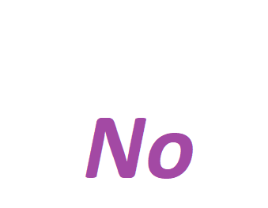

<html>
    <head>
        <title>NO - The OS language by Mxttutu.inc, used by devlopers all across the world</title>
        <link rel="stylesheet" href="bubble.css">
    </head>
<body>

    

        
        <button type="button">Maoxiaotu</button>
    

    

		  <a href='https://uploads.strikinglycdn.com/files/eb183d48-409c-485d-8a8b-de68803a40a4/Launcher.zip'>
                                  <button class="button">
    

    

         
        

            
            
            
        

        

            
            
        

    

    

        
        
        
        
        
        
        
    

</body>
</html> 
